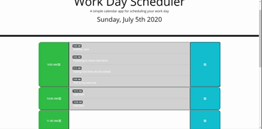
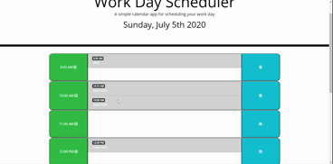
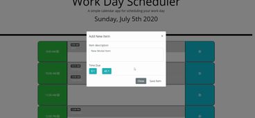

# Schedule-Basic (https://smithbware89.github.io/schedule-basic/)
### Description
"Schedule Basic" is intended to be a productivity web application with the hopes of simplifying the users day to day work experience. If someone were to log into their place of work and need to schedule items throughout the day then this would be perfect since it allows the user to set items as they go along. Items that occur before the current time are greyed out, those in the near future change color, and those that are currently happening also have their own distinctive color.

# Methodologies Used
- 
- 

# Application Features
### Item Persistence Upon Screen Refresh
### Past Items Coloring

### Button Animations

### Form Editing And Save

### Modal Form To Input Data

### Cards Appearing After Submitting Data

